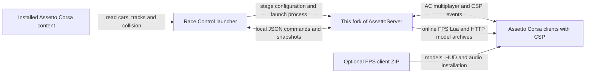

# Local release packaging

Implemented release: **0.0.55-pre35**, retaining the existing server version.
FPS content remains **client pack 45**. The launcher and server share version
metadata in `Release/Release.props`.

Build all Windows x64 artifacts with:

```powershell
pwsh -NoProfile -File tools/Build-RaceControlRelease.ps1
```

Output: `dist/v0.0.55-pre35/`. An existing version directory is never overwritten.
The builder retains isolated staging under .artifacts for inspection, packages
the current working tree as Corresponding Source, and writes release.json plus
SHA256SUMS.txt. ZIP entries have stable order and timestamps. Inno executables
are unsigned; compiler metadata prevents claiming identical installer bytes.

Artifacts: selectable Setup.exe; Full, Launcher, Server, FPS client and FPS maps ZIPs; and
a matching Source ZIP. Both host ZIPs include self-contained .NET runtime files.
The server ZIP also includes its own runtime. The Full ZIP carries FPS assets
once in Packs/Fps and four maps in Packs/FpsMaps; launcher/server binaries contain
no embedded FPS models/audio.

Portable hosts use Data below their extracted root. Settings and preset payload
paths are stored relative to that root. Imports, temp files, logs, exports, caches
and staged instances stay there. Read-only storage fails with a visible error;
there is no AppData fallback. Assetto Corsa remains an external read-only content
source. Windows, GPU-driver and OS-managed caches are outside application control.

Setup offers Racing host, Full host, FPS client only and Custom. FPS host assets
and client installation are separate choices because a host need not be a player.
Client-only installation requires a selected game root containing acs.exe.
Game/CSP/cars and other tracks are not included. Client files remain on uninstall, as does
installed launcher user data. A portable full host does not write into the game;
players install the separate FPS overlay deliberately.

Launcher-only users can import this release's Server ZIP and optional FPS ZIP in
Settings > Local Installations. Server execution checks the release manifest,
payload hashes and executable capability output. Downloads target the exact
matching fork version, using HTTPS and SHA-256; they become available after the
release assets are published under `race-control-v0.0.55-pre35`. Until then use
offline ZIP import. No GitHub tag or release is created by the local builder.
Do not reuse the inherited upstream `v0.0.55-pre35` tag for the modified fork.

Validate an artifact set with:

```powershell
pwsh -NoProfile -File tools/Test-RaceControlRelease.ps1 -ReleaseDirectory dist/v0.0.55-pre35 -EvidenceDirectory .artifacts/release-verification-new
```

Use tools/Test-RaceControlLocal.ps1 against an extracted Full directory for
racing/FPS server checks. See the release's VALIDATION.md for actual acceptance
results and remaining manual checks. The inherited upstream tag workflow is not
the Windows launcher release pipeline; public publishing/CI is a separate step.

## FPS maps and sanitized defaults

Map pack 1 contains only these captured maps:

| Map | Track ID | Version | Spawn points |
| --- | --- | --- | --- |
| Nuketown 2020 | bo2_nuketown_2020 | 0.1.10 | 32 |
| Fire Pit | fire_pit | 0.1.0 | 12 |
| Krvava Rotunda | krvava_rotunda | 0.1.0 | 16 |
| Shipment 1519 | shipment_1519 | 0.1.0 | 4 |

The Full ZIP and Full host installer selection include them in Packs/FpsMaps.
FPS-maps-v1.zip is optional and independent of FPS-client-v45.zip. Settings can
import/download maps into Data/Packs/FpsMaps. The scanner prefers bundled versions
over installed copies so prepared data and server content agree. Client maps and
hosting maps are separate installer choices. Players explicitly extract the map
ZIP into their game or select the client map component. Portable hosting only
reads the external game.

Each map includes models, UI, lighting/scripts, surfaces and its original README,
plus race-control/arena.json, geometry.bin, navigation.bin and prepared.json.
Seeds carry relative model names and SHA-256 hashes, not source-PC cache keys.
The launcher checks the actual inputs and preparation options before importing
the seed into its local cache. Changed content/options trigger fresh preparation
using the selected map's content root, including for bundled maps.

Release/Content is an explicit snapshot. Capture it once with
tools/Capture-RaceControlReleaseContent.ps1, providing a built Core assembly and
server payload. It reads the specified Race Control profile and installed maps,
exports only four selected arenas/cache pairs, and sanitizes the latest saved
Racing/FPS presets. Shipment's old preparation format was regenerated in isolated
workspace staging; the original profile was not modified. Conversion reports,
arena backups, catalog caches, logs, instance history and unrelated maps are
omitted. Large map inputs are Git-ignored and explicitly included in the matching
Source ZIP, so that ZIP builds without the original PC's profile.

Defaults/settings.json captures UI preferences. Defaults/fps.json and racing.json
capture gameplay/grid/weather settings; startup.json captures the default mode.
The full package starts with Modern TeamDeathmatch on Nuketown, 10 minutes,
100 kills, six slots and the captured bot/loadout preferences. Launcher-only
without FPS assets uses Racing until FPS is selected after installing components.
Preset IDs are generated afresh. Installation paths, personal names, passwords,
network addresses/ports and remembered page/session state are reset. No previous
presets or history are imported. Existing saved settings and arena customizations
take precedence over these templates.

Retain all map READMEs and notices. Some map artwork notices explicitly restrict
public distribution pending provenance review. This is a local review release;
no public upload is performed or implied.

The analysis below records the original architecture and decisions. Its proposed
steps and pre-implementation evidence are historical; the implementation above
and actual release validation take precedence.

---

# Race Control release packaging assessment

Examined on 2026-09-06 at repository commit `c0b3010`. Release layout and portability
decisions below were subsequently confirmed by the user in the same discussion.
This is the release specification and assessment, not an implemented packaging
change or a release acceptance report.

The three requested distributions are feasible. The essential constraint is that
Race Control currently requires this repository's modified AssettoServer. An
arbitrary upstream AssettoServer installation is not compatible with the current
launcher, including its ordinary server start/stop path.

## Confirmed release layout

The release output root is `F:\Coding\Codex\Mods\AssettoCorsaMods\dist\`.
Every release receives a new `dist\<version>\` directory containing its Inno Setup
installer and separate ZIP artifacts. `v1.0` is an example, not an assigned first
release version. Maintain our fork exclusively; upstream server compatibility
is outside the supported product scope.

Example contents:

```text
dist/
  v1.0/
    RaceControl-v1.0-Setup-win-x64.exe
    RaceControl-v1.0-Full-Portable-win-x64.zip
    RaceControl-v1.0-Launcher-Portable-win-x64.zip
    RaceControl-v1.0-Server-Portable-win-x64.zip
    RaceControl-v1.0-FPS-Client.zip
    RaceControl-v1.0-Source.zip
    release.json
    SHA256SUMS
```

Use one explicit release version for the directory, artifact names, application
metadata, and release manifest. Keep FPS pack/protocol and server compatibility
versions as separate manifest fields, even when the client ZIP filename carries
the enclosing product release version.

The offline Inno installer offers selectable launcher, fork-server, and FPS
components, with Racing, Full, and Custom selections. Support client-pack-only
installation for players who do not host. Validate component dependencies before
installation; the launcher can be installed without a server and acquire the
compatible server later. Unselecting FPS reduces installed size, but an offline
installer still contains the FPS download bytes.

Compile with `C:\Users\iztok\AppData\Local\Programs\Inno Setup 7\ISCC.exe` on this
workstation. Build the installer and ZIP variants from the same versioned payload
and component manifest. The packaging tool may create temporary staging under
`.artifacts`, but only complete release outputs belong in `dist\<version>`.
Do not overwrite an existing release directory or delete older versions when
publishing a new one. Keep generated `dist` contents out of Git.

## Fully portable ZIP contract

The application/server ZIP editions must keep every application-controlled write
inside the extracted package root. Installation-free with AppData storage does
not satisfy this requirement. A proposed extracted layout is:

```text
RaceControl/
  AssettoServer Race Control.exe
  portable.json
  lib/
  lang/
  Packs/
  Data/
    settings.json
    Presets/
    Grids/
    FpsArenas/
    Servers/
    Instances/
    History/
    Cache/
    Logs/
    Downloads/
    Exports/
    Temp/
```

Include the portable marker in application/server ZIP editions and omit it from
ordinary installer deployments. Determine the package root from the executable
location and explicit package metadata, not the caller's working directory.
The server-only ZIP must also satisfy the contract when launched directly.

Portable behavior must include:

- settings, presets, grids, arena sidecars, caches, logs/crash reports, server
  instances, history, credentials/keys, component downloads, and temporary files
  all resolve inside the package;
- launcher downloads/imports place compatible server and FPS files inside the
  package; a selected external server is read/copied into the package, not modified;
- bundled/downloaded component paths are stored relative to the package, and a
  move to a different directory or drive preserves saved application state;
- external AC content and CM presets may be read, but portable mode does not
  install into AC, write CM presets there, register the application, or migrate
  installed-edition AppData automatically; exports go under `Data\Exports`;
- missing/unwritable portable storage produces a clear error; it never silently
  falls back to AppData, Documents, or system temp;
- the portable edition runs with its supplied runtime and never installs a
  machine-wide .NET runtime or persistent environment/registry settings.

Installed AC, CM, and CSP are external programs with their own storage. This
contract covers our launcher/server processes and helpers; it does not imply
that running AC itself leaves no Windows/game-managed files. The separate FPS
client ZIP is an AC content overlay: the user extracts it into the chosen AC
root, and its entries stay within that extraction root. Extracting it beside
the host launcher alone does not make it active in the external AC installation.
Portable host editions must not silently install that overlay outside their root.

Concrete implementation gaps found in the current code:

| Location | Required change |
| --- | --- |
| `RaceControlPaths` and the independently created paths in `App`/`MainViewModel` | Resolve one consistent installed/portable storage policy before any stores initialize |
| `App.OnDispatcherUnhandledException` | Replace the separate hardcoded AppData crash-log path with the resolved Logs directory |
| `FpsArenaPreparationService.PrepareAsync` | Replace system-temp staging with the resolved Temp directory |
| `ServerProcessController` and preparation helpers | Set working directories and process-scoped temporary storage for all server/helper launches; keep generated keys and outputs under the package |
| `FindServerPayload`, settings and preset persistence | Prevent accidental use of parent-directory development builds; resolve portable component paths after relocation |
| CM export and ZIP save dialogs | Keep portable exports inside the package and reject destinations that escape it |
| Release publisher | Supply runtime/native files without default extraction into system temp; keep validation dependencies available in their own artifact |

For portable artifacts, prefer self-contained folder publishing with loose native
runtime files. The current launcher uses `IncludeNativeLibrariesForSelfExtract`;
.NET extracts those libraries before application startup, normally under
`%TEMP%/.net` on Windows. Setting a variable in WPF startup is too late. A bootstrap
could set `DOTNET_BUNDLE_EXTRACT_BASE_DIR` before launch, but folder publishing
avoids needing that extra launch wrapper.
[Microsoft single-file deployment documentation](https://learn.microsoft.com/en-us/dotnet/core/deploying/single-file/overview).

Portable acceptance must trace file/registry writes from the actual extracted
launcher, server, preparation helpers, and download paths; exercise startup,
staging, FPS preparation, exports, errors, and shutdown. Move the package to a
new path and drive and repeat. Verify separate extractions have independent
settings, installed-edition AppData stays unchanged, and an unwritable root
fails without writing elsewhere. Report OS-managed effects separately instead of
claiming that copying files into a ZIP proves full portability.

## How the components fit together



- `AssettoServer/` is a complete custom AC server, forked from
  `compujuckel/AssettoServer`. Our additions include server-authoritative race
  bots, rigid-body preparation/simulation, FPS simulation and packets, and the
  Race Control command/telemetry bridge. These additions are compiled into the
  server; they are not an independently installable upstream plugin.
- `AssettoServer.RaceControl/` is the .NET 10 Windows WPF event editor and process
  launcher. Its Core project handles content scanning, presets, configuration,
  staging, local live control, and the browser dashboard. The server targets
  .NET 9. The existing publisher supplies self-contained runtimes for both.
- The launcher reads the host's installed game content, generates
  `server_cfg.ini`, `entry_list.ini`, and `extra_cfg.yml`, copies car checksum
  data and track AI lines, and invokes the server to prepare collision/navigation
  data. It stages and runs an isolated copy under
  `%LocalAppData%\AssettoServer Race Control\Instances\Current`.
- Live control uses files in `race-control-live`, including `state.json`,
  `track.json`, and command files. This is a local process integration, not a
  general manager for an arbitrary remote AssettoServer installation.
- Players run Assetto Corsa and connect over normal AC multiplayer, typically
  using Content Manager's Online > LAN view. They do not need the host launcher
  or server binaries simply to join. Matching cars and tracks remain separate
  prerequisites. The current renderer requires CSP for Racing as well as FPS.
- FPS uses normal AC car slots as hidden, immobilized carriers. Our server
  handles movement, collision, bots, damage, and match rules; its CSP online Lua
  handles player input, camera, rendering, and presentation. The game executable
  is not patched by the FPS client pack.
- `ACeditor/` is a separate authoring application and release path. The other
  `*Plugin` projects are server plugins, not additional client packs. The Race
  Control publisher currently publishes the server project directly and does
  not explicitly build/package those optional plugin projects or FastLaneUtils.

Evidence: [stager](../AssettoServer.RaceControl.Core/Staging/ServerInstanceStager.cs),
[process controller](../AssettoServer.RaceControl.Core/Runtime/ServerProcessController.cs),
[live client](../AssettoServer.RaceControl.Core/Runtime/LiveRaceControlClient.cs),
[server registration](../AssettoServer/Startup.cs),
[FPS world](../AssettoServer/Server/Fps/FpsWorld.cs).

## Existing packaging and measured payload

[`tools/Publish-RaceControl.ps1`](../tools/Publish-RaceControl.ps1) already builds
a portable launcher plus this fork's server under `lib/Server`, localization
under `lang`, and documentation/notices. It always includes the server. It does
not generate the requested release variants, an outer release ZIP, a standalone
FPS ZIP, a release compatibility manifest, checksums, or a corresponding-source
release artifact.

The existing `out-race-control` folder was inspected without rebuilding it:

| Item | Observed size |
| --- | ---: |
| Entire portable folder, 169 files | 836.97 MiB |
| Launcher EXE | 302,417,558 bytes |
| Server EXE | 337,288,163 bytes |
| Loose `lib/AssettoServer.RaceControl.Core.dll` | 228,374,016 bytes |
| FPS resources embedded in that Core assembly, 128 files | 217.41 MiB |
| FPS client ZIP generated in memory from that assembly, 130 entries | 205.22 MiB |

These are measurements of the existing build, not predicted sizes after
refactoring. The in-memory export used an example carrier identifier solely to
exercise the archive builder; it did not check or install game content.

The loose Core DLL is deliberately loaded by `Test-RaceControlLocal.ps1`.
The WPF launcher also bundles its Core dependency. Move this testing copy into a
validation artifact before removing it from public packages; do not break the
existing smoke harness by simply deleting its dependency.

The launcher/Core embed the FPS models, animations, HUD, and audio. The server
separately embeds the FPS models/animations/textures and its online Lua. Thus,
omitting the exported client ZIP does not remove the large FPS content from the
host download.

## Proposed release downloads

Produce the Inno installer and fully portable Windows x64 ZIPs together for each
release. The publisher accepts `win-arm64`, but the
server's declared runtime/native dependency configuration is not set up as an
equivalent supported Windows ARM64 release. Do not advertise it without separate
implementation and validation.

| Download | Contents | Audience |
| --- | --- | --- |
| `RaceControl-<version>-Setup-win-x64.exe` | Offline Inno installer with selectable launcher, matching server, and FPS components | Users who want installation, shortcuts, and uninstall support |
| `RaceControl-<version>-Full-Portable-win-x64.zip` | Launcher, matching fork server, FPS assets/client pack, notices and setup instructions | Hosts wanting everything available offline for setup |
| `RaceControl-<version>-Launcher-Portable-win-x64.zip` | Launcher and its runtime/localization, with no server or large FPS assets after extraction described below | Hosts providing a compatible server, or using Download prerequisites |
| `RaceControl-<version>-FPS-Client.zip` | The existing AC-root layout for FPS assets, HUD, audio, compatibility manifest and notices | Players joining FPS sessions; optional for people who only race |

Also publish `RaceControl-<version>-Server-Portable-win-x64.zip` as a supporting release
asset for the prerequisite downloader and users who obtain the compatible server
separately. This is not an additional required installer for Full users.
Corresponding source and `SHA256SUMS` accompany the binary downloads.

The launcher-only path plus **Download compatible server**, with FPS unselected,
provides the requested racing-only installation. A fourth prominently advertised
"Racing bundle" is optional convenience, not necessary for the first release.

"Full" includes our software and redistributable assets. It does not mean Assetto
Corsa itself, DLC, arbitrary installed cars/tracks, Content Manager, or CSP are
included. Publish a clean application payload, not an exported personal event:
the existing **Export package** function copies a staged server instance, which
can contain game-derived data and the event's private configuration.

Keep the server installation outside the AC game root. Upstream explicitly
documents conflicts between the game's and server's Steam SDK DLLs.
[Upstream installation instructions](https://assettoserver.org/docs/intro/).

## External server support and Download prerequisites

The Local Installations settings and saved presets already support
`ServerPayloadPath`. However, validation checks only that the directory and
`AssettoServer.exe` exist. Staging recursively copies that directory; it does not
attach to or manage the original running server in place.

Our launcher always passes `--shutdown-file` and normally
`--race-control-directory`. Race bots additionally require
`--prepare-race-physics`; FPS requires `--prepare-fps-arena`, FPS configuration,
and packet/script support. These options are in our
[`Program.cs`](../AssettoServer/Program.cs) and absent from the inspected
[upstream entry point](https://raw.githubusercontent.com/compujuckel/AssettoServer/master/AssettoServer/Program.cs).
Disabling FPS alone therefore does not make upstream work. The configuration
renderer also emits fork-specific race settings even when racing bots are off.

Support "bring a compatible build of this fork". The user chose to maintain our
own fork exclusively; do not implement or advertise an upstream-compatible mode.

Recommended prerequisite flow:

1. Show the detected AC installation, compatible server status, and optional FPS
   pack status. Allow browsing to an existing server and importing an offline
   server ZIP. State when a selected server is upstream/unsupported.
2. **Download compatible server** resolves a release of `preseznik/ACServerBots`
   approved for this launcher. Record exact component versions and capabilities
   in a small release manifest. Initially accept the matching release instead
   of claiming an untested cross-version range.
3. Install to `Data\Servers\<version>` under the extracted root in portable
   editions, or a versioned directory under the installed edition's AppData
   storage. Update the selected payload path and preserve user-provided
   installations and presets.
4. Download to the edition's resolved temporary storage, check the expected SHA-256 and archive paths,
   inspect a machine-readable capability report, and promote the completed
   directory atomically. Reject incomplete or incompatible payloads before
   staging an event. A proposed `--capabilities-json` command would report fork
   identity, control protocol, preparation formats, and supported modes.
5. Keep FPS an explicit optional selection. Detect/link to external game, CM,
   and CSP prerequisites rather than treating them as files hosted by our repo.

A GitHub downloader is straightforward, but **latest compatible** is the right
selection rule. At inspection time, upstream's
[`releases/latest`](https://github.com/compujuckel/AssettoServer/releases/latest)
resolved to `v0.0.54`. It is not our fork. GitHub's latest-release endpoint also
excludes prereleases, while our inherited workflow marks releases as prereleases.
Use an explicit release channel/manifest or a pinned tag instead of assuming
`releases/latest` includes preview builds.
[GitHub release API](https://docs.github.com/en/rest/releases/releases#get-the-latest-release).

## Making FPS genuinely optional

There is currently one client pack: FPS, with Blocks and Modern themes within it.
The authoritative builder declares client pack **45**, ready protocol **3**, HUD
bridge **12**, and minimum CSP **0.3.0-preview520**. Some paragraphs in
`race-control.md` still describe older pack versions; release metadata and user
instructions should come from the current constants/manifest.

The client ZIP installs only its manifest/readme and project-specific locations:

- `content/objects3D/asrc_fps/`: models, animations, textures and attribution;
- `extension/audio/asrc_fps/`: audio and its provenance;
- `apps/lua/asrc_fps_hud/`: companion HUD and audio player.

The carrier car and arena track are requirements, not ZIP contents. The pack
builder currently records a caller-supplied carrier car, so the public pack
should document that the actual carrier/track requirement belongs to the server
being joined instead of accidentally advertising one developer's preset.

The server sends `fps.lua` automatically and serves separate base-v21 and
Modern-v9 model archives over HTTP. The Lua currently requests those remote
archives even when the local client ZIP has been installed. Therefore a local
client pack does not currently replace the server's HTTP asset delivery. The
companion HUD has a fallback when absent/incompatible; that does not establish
that the complete HUD/audio experience is available without the local pack.

For the clean split, keep one launcher and one server codebase, and move the large
embedded FPS files into an external, versioned asset pack. Keep the small FPS
simulation and UI code compiled normally; a plugin framework is unnecessary.

Use the same canonical pack as the source for client export and server model
archives, retaining their existing layouts and versioned HTTP URLs. The Full
bundle includes it, while Launcher and base Server omit it. Add a pack resolver
to Core and the server, and make staging carry the selected pack location/data
into the runnable instance. An exported portable FPS server must also carry its
required assets rather than an absolute path back to the host.

Without the pack, Racing must work normally. FPS launch/export should show a
clear install action, and its asset endpoints should return a controlled missing
pack response. Do not eagerly load missing FPS assets during ordinary startup.
This requires changes to the embedded-resource loaders and HTTP archive builders,
not gameplay rules. Preserve pack hashes and the CSP cache-busting revisions.

The public CSP page currently recommends `0.2.11`, below this FPS pack's declared
preview requirement. Treat exact CSP compatibility as a visible prerequisite
and test it; downloading public recommended CSP is not a sufficient FPS setup.
[Official CSP downloads](https://acstuff.ru/patch/).

## Release work and acceptance

Implement in this order:

1. Define component versions/capabilities, implement the portable storage
   contract, extract optional FPS assets, and add the missing-pack behavior.
   Remove the extra Core DLL from public output while retaining a usable
   validation harness.
2. Extend the publisher to produce the Inno installer, application/client ZIPs,
   and server-only asset together under `dist\<version>`, with complete notices,
   source instructions, stable ZIP entry
   timestamps/order, a release manifest, and SHA-256 checksums. The current FPS
   ZIP writer does not normalize entry timestamps.
3. Add compatible-server selection/download and optional pack installation.
   Keep installation/import limited to declared package locations, with rollback
   on interrupted updates.

Replace or extend the inherited GitHub workflow before using it for this release.
It currently runs Ubuntu with a .NET 9 SDK and solution-wide `dotnet publish`,
despite the solution now including .NET 10 WPF projects. Add an explicit Windows
x64 build job and target the intended projects; keep optional upstream server
plugins and the unrelated editor outside this release's default contents.

Retain AGPL licensing and upstream in-game legal notices. Distribute the matching
Corresponding Source/build inputs and offer its download to remote users of the
modified server; add a fork-specific source link alongside the retained legal
text. These follow sections 5, 6, and 13 of the
[upstream license](https://raw.githubusercontent.com/compujuckel/AssettoServer/master/LICENSE).
Carry all model/audio attribution into the relevant artifacts. The Modern
manifest already records user-confirmed redistribution rights, and the audio
notice records the authorized paid generation plan; preserve that provenance.
The exporter's GPL license in the Modern manifest is the exporter's license, not
a replacement for the source models' licensing information.

Release gates should cover:

- fully portable ZIP behavior, process write tracing, relocation, independent
  extractions, and unwritable-root failure as specified above;
- Inno Racing/Full/Custom and client-only selections, upgrade/uninstall, and
  preservation of user state and unrelated game content;
- a clean Windows machine without developer SDKs: Full launch, content detection,
  staging, server start/stop and live control;
- Launcher with no server, the matching downloaded server, an incompatible
  upstream server, a mismatched fork, and interrupted download/import;
- Racing with no FPS pack installed, plus adding/removing the pack while
  preserving racing presets and game files;
- FPS installation on a separate client with the declared CSP/carrier/track,
  both themes, HUD/audio, HTTP asset loading, and two-client play;
- archive membership, source/license/attribution coverage, version agreement,
  checksums and reproducible ZIP construction;
- existing server/Core regressions and `Test-RaceControlLocal.ps1` packaged
  racing/FPS gates after adapting the smoke tooling to the new payload layout.

The current configuration generator hardcodes `UseSteamAuth: false` and defaults
to local/LAN use. Describe the initial release as LAN-focused; internet hosting
would need a separate configuration/security review and live acceptance.

This assessment verified source paths, the existing published directory, embedded
FPS resources, and successful in-memory client ZIP creation. It did not rebuild
or publish a release, install assets, start a server/game, or establish clean-PC
and multiplayer acceptance.
